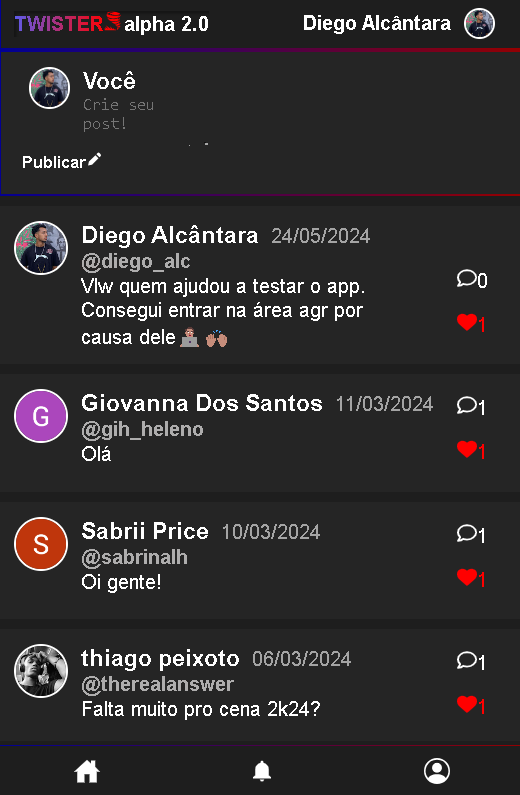
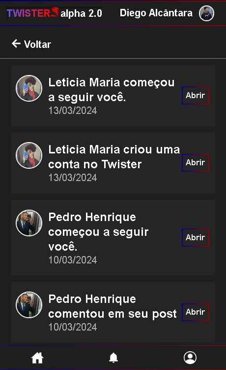
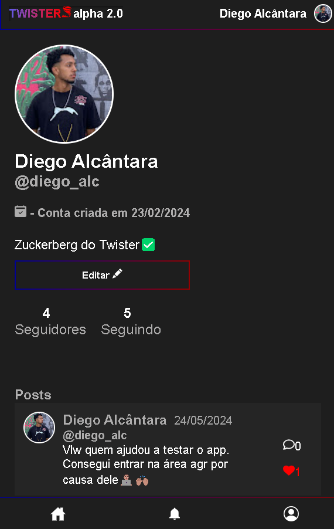
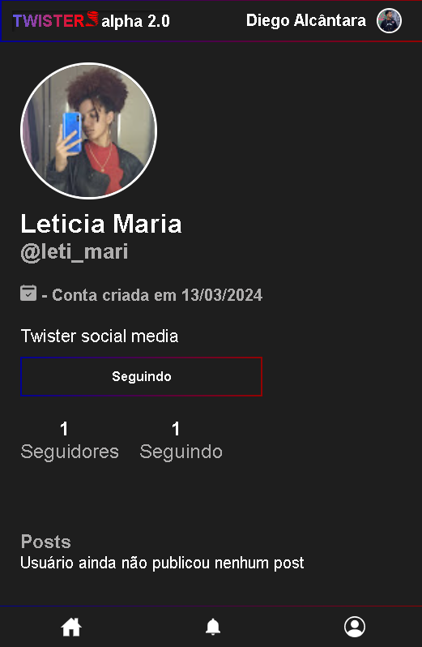
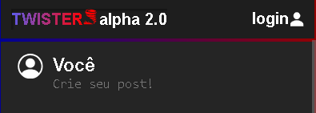
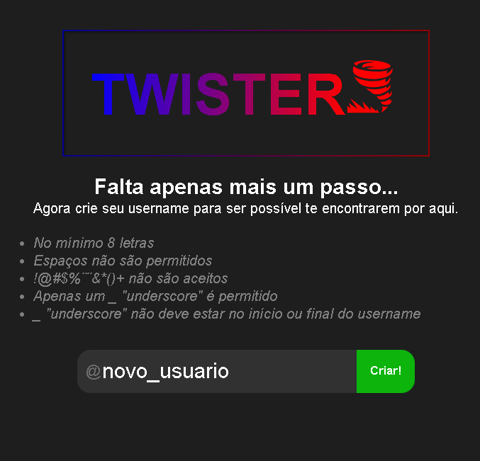
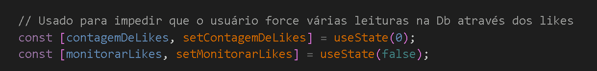
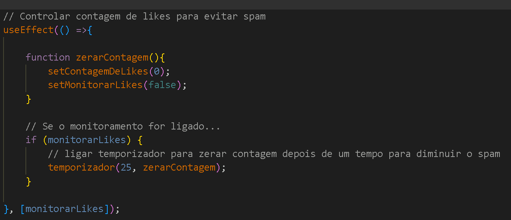
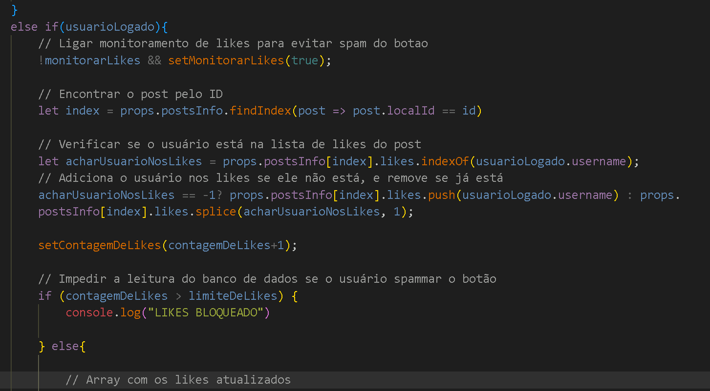

👉 https://twister-social-app.web.app/ 👈

# Twister Social Media

Rede social para compartilhamento de frases e pensamentos, para usuários interagirem entre sí se seguindo, curtindo e comentando em outros posts.

O projeto foi desenvolvido para aperfeiçoar minhas habilidades em React-router, conexão com banco de dados e tratamento das informações que seriam atualizadas a todo o momento pelos próprios usuários. o Twister foi apresentado na entrevista de emprego que forneceu minha primeira vaga na área de desenvolvimento.

# Como utilizar?

Você pode acessar o Twister através desse link:

https://twister-social-app.web.app/

É necessário criar uma conta no app usando sua conta do google. Dessa forma, o app terá acesso ao seu nome de usuário, e-mail e foto do google que serão utilizados para criar seu perfil e diferenciar suas ações, likes e comentários de outros usuários. (Não teremos acesso a nenhum dado sensível).

Após login, será necessário criar seu nome de usuário, respeitando os caracteres permitidos.

Com sua conta criada, será possível interagir com outros usuários e criar seus próprios posts normalmente.

# Tecnologias utilizadas
React | Javascript | Banco de dados Firebase | Sass |  HTML | CSS |

# Porque o firebase?

## LOGIN 
O login é fundamental para que o sistema possa diferenciar qual usuário tomou cada ação antes de registrar no banco de dados. O firebase foi importante para facilitar o processo de login devido a integração com o google ser rápida e não ser solicitado senhas, pois as senhas podem causar desconfiança do usuário por não ser uma rede tão consolidada, e pode desencorajar a interação com a plataforma.

## BANCO DE DADOS E HOSTING 
O firebase fornece um serviço de banco de dados e hosting bem intuitivo, onde a curva de aprendizado foi leve, atendia as necessidades do meu projeto, e pude evitar gastos que seriam cobrados por outras plataformas que fornecem serviços parecidos.

# Lógica

Devido a escolher um banco de dados gratuito, o firebase possui um limite de leituras e escritas permitidas no banco de dados por um período de tempo. Devido a isso, criei um sistema para reduzir ao máximo o número acessos ao banco pelo usuário evitando spams. Identifiquei que a forma mais fácil de spammar acesso a DB era através dos likes, pois o sistema precisa ler o número de likes para depois registrar a alteração, assim sendo 2 registros por clique.

Primeiro criei as váriaveis responsáveis por contar quantas vezes o usuário clica no like

O monitoramento é ligado após o usuário clicar no like pela primeira vez. Criei um temporizador onde a contagem irá zerar após 25 segundos

Por fim, o sistema irá identificar se o usuário passou do limite de likes permitido em um intervalo de 25 segundos, e não irá registrar sua ação na DB caso tenha passado desse limite.

Realizei um teste spammando o like com 145 cliques em um intervalo de 25 segundos, o que resultaria em 290 acessos no banco de dados inicialmente.

Com a lógica do monitoramento de likes, apenas 40 acessos na DB foram realizados, e 250 acessos desnecessárias foram evitados.

 

## Você pode ajudar testando o projeto nesse link
👉 https://twister-social-app.web.app/ 👈

  

<strong>| Criado por Diego Alcântara 👨🏽‍💻 <a style="font-weight: bold" href="https://www.linkedin.com/in/diego-alc%C3%A2ntara-790424235" target="_Blank">Acessar linkedIn</a></strong>